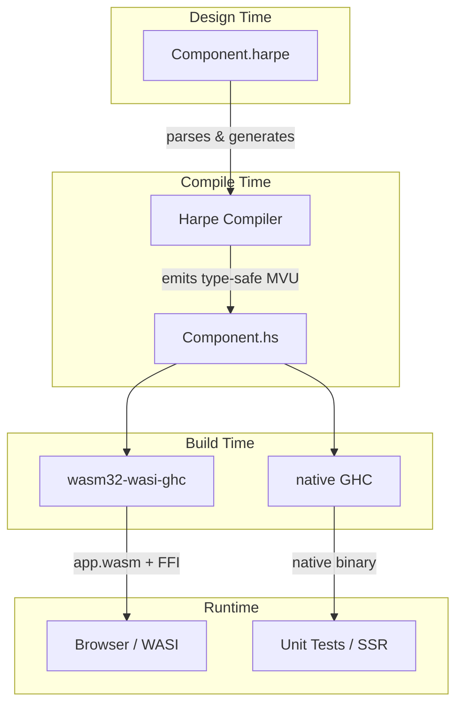

# Harpe

**A declarative, zero-boilerplate MVU framework for Haskell → WebAssembly.**

Harpe brings the ergonomics of Single-File Components (like Svelte or Vue) to the strict, type-safe world of Haskell. By leveraging GHC's WebAssembly backend (`wasm32-wasi-ghc`), Harpe allows you to build reactive web applications using the Model-View-Update (MVU) architecture without the usual boilerplate.

## Why Harpe?

* **HTML-First, Not Combinator-First:** Write standard HTML and inject Haskell directly using `//= ... =//` transitions. Stop fighting with deeply nested DOM combinator functions.
* **Painless Component Composition:** Embedding a child component in standard MVU is notoriously verbose. In Harpe, simply writing `//= clinch Child.harpe =//` automatically composes models, wraps messages, and delegates update loops.
* **Inline JavaScript FFI:** Write JS directly in your templates using `alien` blocks. Harpe generates the GHC WASM JS FFI imports, type conversions, and safe native stubs automatically.
* **Pure Rendering, Isolated Effects:** The view cycle runs in a pure `Html` reader monad. Side effects and DOM mutations are explicitly separated into `crude` blocks and executed after the render cycle.
* **Native-Safe:** Compiles seamlessly under native GHC (stubbing out WASM FFI), allowing you to run your full test suite natively without a WASM toolchain.

## Architecture



## Quick Start: A Minimal Component

Harpe keeps your state logic and view in a single file. Types and updates go at the top, the reactive layout goes at the bottom.

```html
-- 1. Standard Haskell Types & Logic
data AppState = AppState { count :: Int } deriving Show
type Model = AppState

data Msg   = Increment | Reset
data Event = Counted Int

initModel :: Model
initModel = AppState 0

update :: Msg -> Model -> (Model, [Event])
update Increment m = (m { count = count m + 1 }, [Counted (count m + 1)])
update Reset     m = (AppState 0, [])

-- 2. HTML-First View Layout
//= root
<div class="counter-app">
  <h1>//= show (count model) =//</h1>

  <button //= onClick Increment =//> + </button>
  <button //= onClick Reset =//> Reset </button>

  <!-- Reactive UI Blocks -->
  //= default
    <p>Waiting for interaction...</p>
  //= on Counted n
    <p class="success">You reached //= show n =//!</p>
  =//
</div>
=//
```

## Getting Started

### Prerequisites
* **GHC &ge; 9.6** (GHC 9.14 recommended)
* **Cabal &ge; 3.10**
* **wasm32-wasi-ghc** (WSL/Linux only — via `ghc-wasm-meta`)
* **Node.js &ge; 20** (for Vite dev server)

### 1. Build the Compiler
```bash
cd harpe
cabal build harpe
```

### 2. Compile Templates
```bash
# Compiles all .harpe files in a directory and generates Main.hs
cabal run harpe -- -i src/ -o out/
```

### 3. Build for WebAssembly
```bash
# Compile the generated Haskell code to WASM
wasm32-wasi-cabal build

# Extract the WASM binary
cp "$(wasm32-wasi-cabal list-bin exe:myapp | tr -d '
')" public/myapp.wasm

# Extract the JS FFI shim
node $(wasm32-wasi-ghc --print-libdir | tr -d '
')/post-link.mjs \
  -i public/myapp.wasm \
  -o src/ghc_wasm_jsffi.js
```

## Documentation

For full details on how to use chunks, side-effects, and FFI blocks, check the docs:

* [User Guide](docs/guide.md) — MVU loop, `default/on` blocks, clinch composition, and JS FFI.
* [Syntax & Grammar](docs/grammar.md) — Language specification and TextMate rules.
* [Compiler Specification](docs/compiler.md) — Internals of the parser, AST, and codegen.
* [Runtime Architecture](docs/runtime.md) — The `Html` monad, DOM cache, and effects loop.

## License

Apache 2.0 — see [LICENSE](LICENSE).